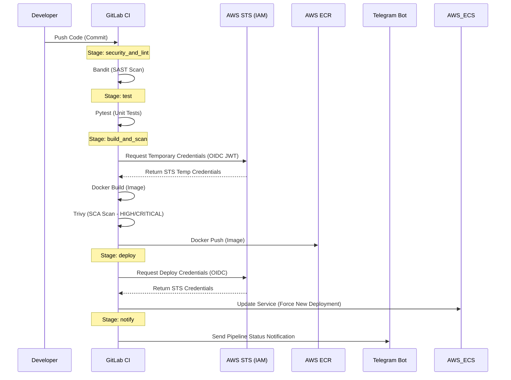

# API Backend - DevSecOps CI/CD & Cloud Infrastructure

## Visión General
Este proyecto implementa una arquitectura segura y automatizada para una API ligera en Python (FastAPI). Utiliza metodologías DevSecOps (Shift-Left) y una arquitectura inmutable gestionada mediante GitLab CI y desplegada en AWS. El objetivo principal es establecer un entorno *Enterprise-Grade* con altos estándares de seguridad y automatización, listo para producción.

## Diseño y Decisiones de Arquitectura

* **Contenedorización (`app/`)**: Implementa un *Multi-stage build* con una imagen base ligera (`python:3.11-slim`) para minimizar el peso y la superficie de ataque. El contenedor opera bajo un usuario *non-root*, aplicando el principio de mínimos privilegios en tiempo de ejecución.
* **Infraestructura como Código (`terraform/`)**: Toda la infraestructura base en AWS se aprovisiona mediante Terraform. Esto incluye repositorios ECR (con escaneo de vulnerabilidades automáticas), clústeres y bases de datos RDS en redes privadas con cifrado en reposo.
* **Alta Disponibilidad y Punto de Entrada Estático (ALB)**: El servicio ECS Fargate ya no está expuesto directamente al público, sino que se sitúa tras un **Application Load Balancer (ALB)**. Esto proporciona un nombre de dominio estático (`api_alb_dns_name`) e implementa el patrón de red *Zero-Trust*, donde el clúster ECS solo acepta tráfico originado estrictamente desde el Load Balancer.
* **Seguridad Identity-First (OIDC + IAM)**: Adopta un enfoque de *Zero-Trust*. En lugar de utilizar Access Keys de AWS de larga duración para el despliegue, se integró OpenID Connect (OIDC). GitLab CI asume temporalmente el rol `gitlab-ci-deploy-role` en AWS mediante un token JWT efímero.
* **Gestión de Secretos en K8s**: En lugar de acoplar la renovación del token de AWS ECR a las ejecuciones de Terraform (lo cual no es ideal para un entorno *enterprise* de producción), se ha diseñado e implementado un **CronJob nativo en Kubernetes**. Este CronJob asume credenciales de solo lectura e interactúa automáticamente con el API de AWS para rotar el token de descarga de imágenes (`ecr-registry-secret`) de forma autónoma.
* **Pipeline DevSecOps (`.gitlab-ci.yml`)**: El ciclo de integración continua incluye múltiples etapas de seguridad integradas:
    * **SAST**: Análisis estático de código Python con `Bandit`.
    * **Unit Testing**: Ejecución automatizada de pruebas con `pytest`.
    * **Build & AWS Auth**: Autenticación segura mediante OIDC y construcción optimizada de la imagen de Docker.
    * **SCA**: Análisis de vulnerabilidades del sistema operativo y dependencias en la imagen final utilizando `Trivy` (fallando el pipeline si se detectan vulnerabilidades `HIGH` o `CRITICAL`).
    * **Deploy AWS ECS**: El pipeline dispara una actualización forzada (`force-new-deployment`) del servicio ECS en AWS para desplegar la nueva versión.
    * **Push & Notificaciones**: Subida de la imagen a ECR y envío de notificaciones de estado en tiempo real vía Telegram.

## Diagrama de Flujo (DevSecOps Pipeline)



## Estructura del Proyecto

```text
.
├── .gitlab-ci.yml    # Pipeline DevSecOps (SAST, Test, OIDC Build, Trivy, ECS Deploy, Notify)
├── app/              # Código fuente de la API (FastAPI)
│   ├── Dockerfile
│   ├── main.py
│   ├── requirements.txt
│   └── test_main.py
├── k8s/              # Manifiestos de Kubernetes y scripts de monitoreo
│   ├── deployment.yaml
│   ├── install_monitoring.sh
│   └── monitoring-values.yaml
├── terraform/        # IaC para aprovisionar AWS
│   ├── alb.tf        # Application Load Balancer y Target Groups
│   ├── ecr.tf        # Repositorios Elastic Container Registry
│   ├── ecs.tf        # Clúster ECS
│   ├── ecr_iam.tf    # IAM User y credenciales para el CronJob de ECR
│   ├── grafana_iam.tf# IAM User para DataSource de CloudWatch
│   ├── k8s.tf        # Infraestructura EKS/K3s y CronJobs
│   ├── oidc.tf       # Proveedor OIDC y Trust Policies IAM para GitLab
│   ├── providers.tf  # Configuración de proveedores (AWS)
│   └── rds.tf        # Base de datos RDS PostgreSQL
└── README.md         # Documentación del proyecto
```

## Transición desde GitHub Actions a GitLab CI

> **Nota Histórica / Contexto del Repositorio:**
> Este proyecto fue concebido e implementado originalmente utilizando GitHub Actions (puedes verificar el código histórico en el branch principal: [GitHub - ERAF-2407/pulpoLine](https://github.com/ERAF-2407/pulpoLine/tree/main)). No obstante, debido a las recientes políticas de GitHub respecto a las validaciones de tarjetas de crédito para el uso del *Free Tier* de Actions (las cuales generaron bloqueos en la ejecución de los pipelines), se tomó la decisión técnica y ágil de migrar el flujo CI/CD completo hacia **GitLab CI**. Esta migración demuestra adaptabilidad frente a incidentes de plataforma y fluidez operando múltiples soluciones CI/CD del mercado.

## Preparación para Entrevista (Key Talking Points)

Si presentas este proyecto en una entrevista técnica para **DevSecOps Engineer** o **Cloud Security Engineer**, enfócate en estos 4 pilares clave que demuestran madurez profesional:

1. **Gestión Dinámica de Secretos (OIDC Identity-First)**: 
   *"Como buena práctica de DevSecOps, eliminamos completamente las credenciales estáticas de AWS en nuestro entorno de CI/CD. Implementamos OpenID Connect (OIDC) creando un Identity Provider en AWS que confía criptográficamente en el emisor de GitLab. Ajustamos la política de confianza (Trust Policy) para que la asunción del rol IAM sea estrictamente condicional al ID de nuestro proyecto de GitLab (`project_path:ERAF-2407/pulpoline:*`). Esto erradica el riesgo asociado a la rotación manual y el compromiso de claves de acceso."*

2. **Shift-Left Security en el Pipeline Inmutable**: 
   *"El pipeline no solo despliega código, sino que previene el despliegue de código inseguro. Integramos herramientas de seguridad desde las primeras etapas: realizamos análisis de código estático (SAST) con Bandit y un escaneo riguroso de la imagen construida (SCA) utilizando Trivy. El despliegue a ECR actúa como una compuerta: si Trivy detecta vulnerabilidades Críticas o Altas en las dependencias o el sistema operativo base, el pipeline falla y previene un riesgo en producción."*

3. **Gestión Autónoma de Secretos en Kubernetes**:
   *"Para un entorno enterprise de producción real, depender de Terraform para actualizar un secreto temporal de ECR en Kubernetes genera un acoplamiento riesgoso. Lo he optimizado desarrollando un **CronJob nativo en Kubernetes** que obtiene dinámicamente el token de autorización de ECR usando credenciales IAM restringidas (inyectadas vía Terraform) y regenera el secreto autónomamente. Así, el clúster se vuelve auto-suficiente, sin acoplamiento duro a los pipelines CI o ejecuciones externas de IaC."*

4. **Infraestructura Definida por Software (IaC)**:
   *"Toda la arquitectura, desde el registro ECR hasta los roles IAM hiper-restringidos, está completamente codificada en Terraform. Esto asegura la trazabilidad, replicabilidad y la capacidad de revisar cambios de infraestructura mediante Pull/Merge Requests, evitando las configuraciones manuales o derivas (configuration drift) en AWS."*

4. **Observabilidad Continua (Feedback Loop)**:
   *"Garantizar un ciclo de vida ágil implica tener un feedback inmediato. Por ello, el pipeline notifica automáticamente el éxito o el fracaso del proceso, junto al SHA del commit correspondiente, a un canal de Telegram. Esto facilita al equipo reaccionar rápidamente ante vulnerabilidades bloqueantes o despliegues fallidos."*

## Monitoreo y Observabilidad (Grafana + Prometheus + CloudWatch)

El ecosistema cuenta con capacidad de monitoreo dual para visualizar tanto la carga en Kubernetes (VPS) como los servicios en AWS (ECS).

1. **Kube-Prometheus-Stack (Kubernetes Local)**:
   En el directorio `k8s/` se ha integrado un script y los valores (`monitoring-values.yaml`) para desplegar Grafana y Prometheus vía Helm. Esto permite analizar los recursos del VPS y del clúster de K8s.
2. **Conexión Automatizada a AWS CloudWatch**:
   Se aprovisiona mediante Terraform (`grafana_iam.tf`) un usuario programático con permisos de `CloudWatchReadOnlyAccess`. 
   El script de instalación `k8s/install_monitoring.sh` fue **optimizado para extraer dinámicamente estas credenciales desde los outputs de Terraform**, inyectando CloudWatch como un *Data Source* seguro en Grafana automáticamente mediante los `values` de Helm, eliminando la necesidad de configuración manual o la exposición de credenciales estáticas en archivos de código.
   ```bash
   ./k8s/install_monitoring.sh
   ```

3. **Creación de Dashboard en AWS CloudWatch (Para Entregables Técnicos)**:
   Si se requiere generar un reporte formal, CloudWatch permite construir paneles visuales nativos.
   * Ve a la consola de AWS -> **CloudWatch** -> **Dashboards** -> **Create dashboard**.
   * Nombre sugerido: `API-Production-Metrics`.
   * Añade Widgets seleccionando `ECS > ClusterName, ServiceName` (CPUUtilization, MemoryUtilization) y métricas del `ApplicationELB` (RequestCount, HTTPCode_Target_4XX_Count).
   * **Tip para Reportes**: Usa el botón "Share" en el panel de acciones de CloudWatch para generar un enlace de acceso público o incluye capturas de estos paneles junto con los del Grafana para la presentación a los stakeholders técnicos.

## Endpoint de Producción (ALB)

Para validar la accesibilidad de la aplicación en producción o incluirla en los reportes técnicos, utiliza siempre el DNS estático del Application Load Balancer (ALB). A diferencia de las IPs dinámicas de los contenedores ECS, este endpoint es permanente:

* **Obtener URL estática**:
  ```bash
  cd terraform
  terraform output api_alb_dns_name
  ```
* **Endpoints de validación**:
  * Healthcheck: `http://<API_ALB_DNS_NAME>/health`
  * API Documentación: `http://<API_ALB_DNS_NAME>/docs`

## Instrucciones Locales

Para ejecutar y validar la API localmente mediante Docker:

1. **Construir la imagen optimizada**:
   ```bash
   docker build -t api-backend:local app/
   ```

2. **Ejecutar el contenedor**:
   ```bash
   docker run -d -p 8000:8000 --name api-backend-local api-backend:local
   ```

3. **Verificar el servicio de estado (Health Check)**:
   ```bash
   curl http://localhost:8000/health
   ```
   *Deberías recibir la respuesta: `{"status": "ok", "environment": "production"}`.*
